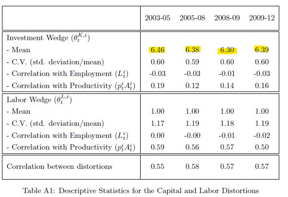
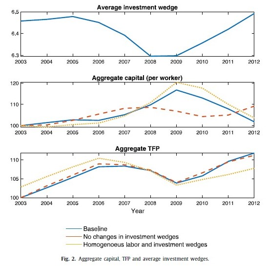

# Introduction

## Motivation

The paper analyzes the influence of financial factors (credit flows and interest rates) on firms’ investment decisions and capital accumulation through their effect on dynamic capital distortions (i.e., deviations
from the optimal allocation of resources across sectors and over time).

The authors build a multi-industry model to measure labor and investment wedges using data for the Mexican manufacturing sector (for 2003–2012) and assess their importance in accounting for aggregate capital and TFP over time.

## Main takeaways

The two results arise:
\begin{itemize}
\item Changes in dynamic capital distortions are important in accounting for the path of capital over time.
\item Industry specific investment wedges (a wedge appears whenever firms deviate from the optimal choice) and credit conditions are correlated. Industries where the availability of credit falls and/or real interest rates increase experience an increase in their capital distortions.
\end{itemize}

## Main contributions

\begin{itemize}
\item Contribute to the strand of literature on the positive effects of the finance sector to the real economy.
\item Setup a production and investment model to measure the wedges for the Mexican manufacturing sector.
\item Build upon  the merged dataset of Meza \textit{et al.} (2019), linking output, employment and investment with credit flows and interest rates for Mexican industries between 2003 - 2013.
\end{itemize}

# The environment

\begin{itemize}
\item $n$ industries, each one a representative firm, facing two distortions: static labor wedge and dynamic investment wedge.
\item Technology: $Y^i_t = A^i_t(K^i_t)^{\alpha^i}(L^i_t)^{1-\alpha^i} $, where $A^i$ is an industry specific shock.
\item Firms own $K$ and maximize expected PV of profits net of expenditures 

$\Pi^i = E_0 \sum_{t = 0}^{\infty} (\frac{1}{1+\iota})^t \left\lbrace p_{t}^{i} Y_t^i - \theta_t^{L,i} w_t L_t^i - \theta_t^{K,i} \times [K_{t+1}^i - (1-\delta) K_t^i]  \right\rbrace $. 

where $\theta_t^{L,i} and \theta_t^{K,i}$ are stochastic industry-specific distortions that affect labor and investment, respectively. Total output is combined $Y_t = \Pi^n_{i = 1} (Y^i_t)^{\omega^i}$, with $\omega^i$ constant expenditure share in each industry.

\end{itemize}

## Model 
\begin{itemize}
\item Static labor allocation
 $L_t^i$ (3) \label{Eq3}
\item Dynamic Euler equation
$\Psi^i$ \label{Eq4}
\item Aggregation

\end{itemize}

## The Meza \textit{et al.} (2019) data set

Two sources:
\begin{itemize}
\item Survey: Encuesta Industrial Anual (EIA), INEGI. ~ 7,000 manufacturing establishments with information on all 86 4-digit NAICS 2007 (rama) industries. (82 when excluding Oil and missings)
\item Administrative data: Universe of commercial credit loans by banks reports  (R04C), CNBV, aggregated annually to 4-digit NAICS 2007 (using  a (probabilistic) crosswalk to match CNBV-NAICS classification).
\end{itemize}

## Measuring labor  wedges ($\theta_t^{L,i}$)

\begin{itemize}
\item Use US data for $\alpha^i$ (Hsieh and Klenow, 2009)
\item Compute revenue productivity: $p_t^iA_t^i =  \frac{p_t^iY_t^i}{(K^i_t)^{\alpha^i}(L^i_t)^{1-\alpha^i}}$
\item Estimate persistence parameter, $\rho_A^i$, for each 2-digit industry (sector) using Arellano-Bond estimator (for linear dynamic panel), recover Fixed Effect for each 4-digit industy (rama) to estimate steady-state (SS) values.
\item The labor wedge is computed from \ref{Eq3}.
\item The persistence parameter $\rho_L^i$ and its SS, are estimated analogously. 
\item Value added shres, $\omega^i$ are computed directly from the EIA
\end{itemize}

## Measuring investment wedges ($\theta_t^{K,i}$)

Iterative procedure
1. Given $\rho_A^i$ and $\rho_L^i$, set initial guess for $\rho_K^i$ and the initial SS values $\bar{\theta^{K,i}}$ and $\bar{K^i}$, and compute the investment wedge with \ref{Eq4}

# Results

## Estimated Capital and Labor distortions
\centering
{width=80%}

Notes: The labor wedge is constructed to be unit mean. 

## Aggregate capital, TFP and average investment wedges.
\centering
{width=80%}

# Conclusion

This study suggests that, 
