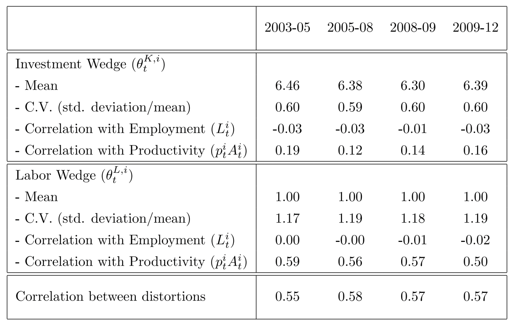
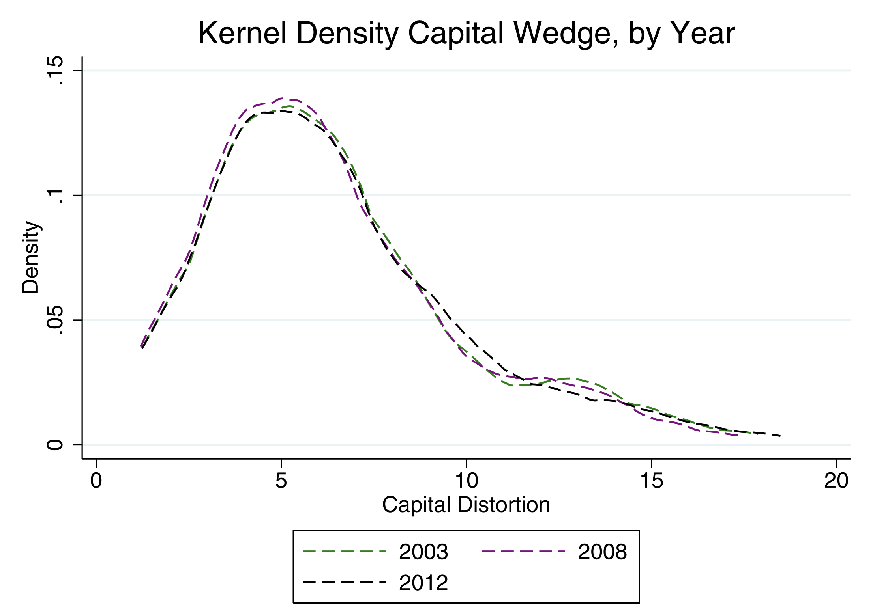
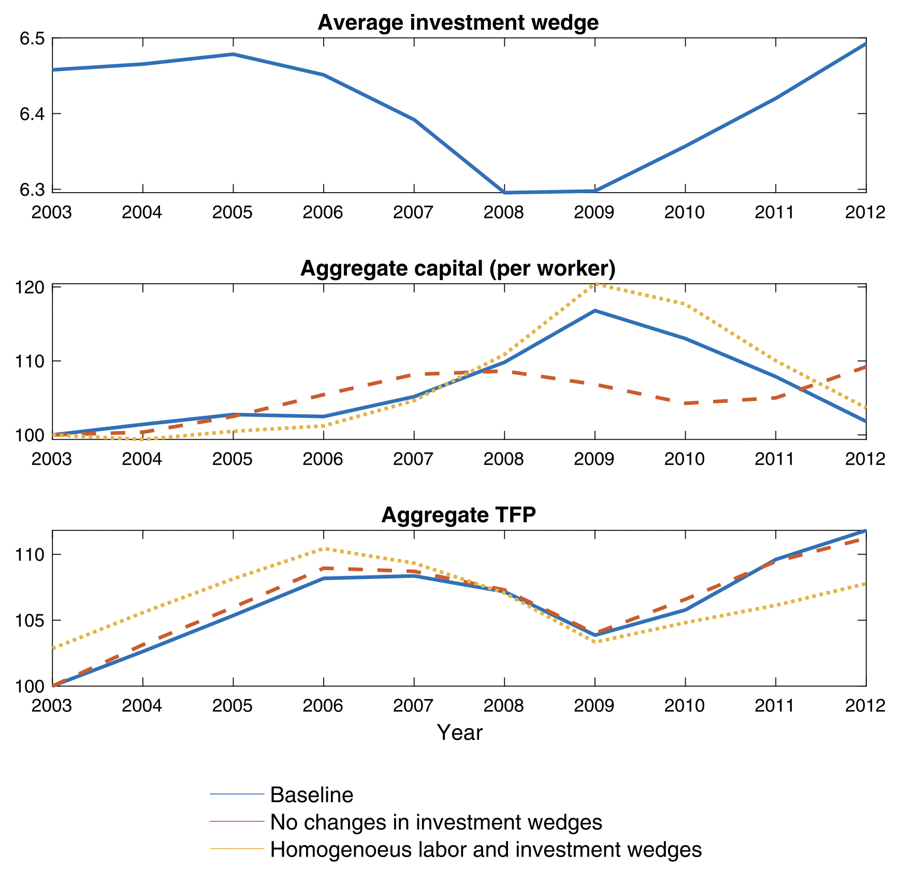
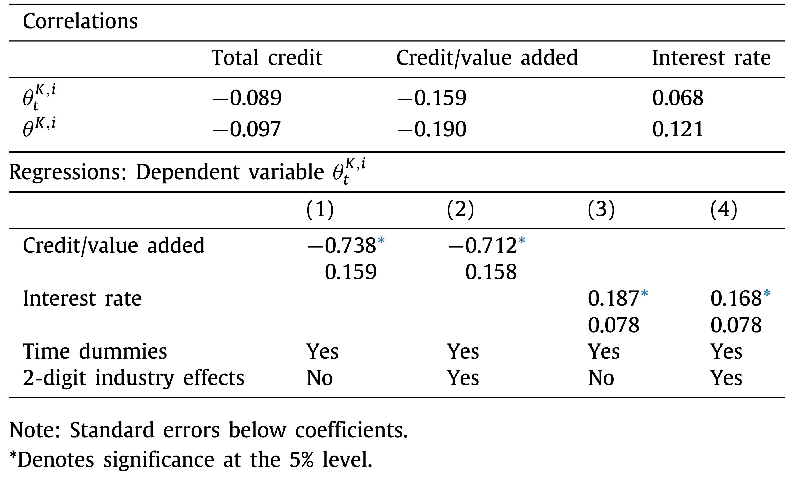

# Introduction

## Motivation

The paper analyzes the influence of financial factors (credit flows and interest rates) on firms’ investment decisions and capital accumulation through their effect on dynamic capital distortions.
<!-- (i.e., deviations from the optimal allocation of resources across sectors and over time) -->

The authors build a multi-industry model to measure labor and investment wedges using data for the Mexican manufacturing sector and assess their importance in accounting for aggregate capital and TFP over time.

## Main takeaways

The two results arise:

- Changes in dynamic capital distortions are important in accounting for the path of capital over time
- Industry specific investment wedges and credit conditions are correlated --- industries where the availability of credit falls and/or real interest rates increase experience an increase in their capital distortions

## Main contributions

- Contribute to the strand of literature on the positive effects of the finance sector to the real economy
- Setup a production and investment model to measure the wedges for the Mexican manufacturing sector
- Build upon  the merged dataset of Meza _et al._ (2019), linking output, employment and investment with credit flows and interest rates for Mexican industries between 2003 -- 2013

# The environment

There are $n$ industries, each one a representative firm, facing two distortions: static labor wedge and dynamic investment wedge.

Technology is described as follows:

$$
Y^i_t = A^i_t(K^i_t)^{\alpha^i}(L^i_t)^{1-\alpha^i},
$$

where $A^i$ is an industry specific shock.

## The environment

Firms own their capital stock and maximize the expected present value of profits net of investment expenditures

$$
\Pi^i = E_0 \sum_{t = 0}^{\infty} \left(\frac{1}{1+\iota}\right)^t \left\lbrace p_{t}^{i} Y_t^i - \theta_t^{L,i} w_t L_t^i - \theta_t^{K,i} \times \left[K_{t+1}^i - (1-\delta) K_t^i\right]  \right\rbrace
$$ 

where $\theta_t^{L,i}$ and $\theta_t^{K,i}$ are stochastic industry-specific distortions that affect labor and investment, respectively.

Total output is combined $\displaystyle Y_t = \prod^n_{i = 1} \left(Y^i_t\right)^{\omega^i}$, with $\omega^i$ constant expenditure share in each industry.

## Model

- **Static labor allocation**

\begin{equation}
L_t^i = \left( \frac{\omega^i(1-\alpha^i)}{\Phi_t \theta_t^{L,i}} \right) L_t 
\label{SLA}
\end{equation}

- **Dynamic Euler equation**

\begin{equation}
\Psi^i \overline{ \theta_t^{K,i}} = \rho_A^i \overline{p_t^i A_t^i } - E_t (1-\alpha^i) \overline{K_{t+1}^i} - (1-\alpha^i)\rho_L^i \overline{\theta_t^{L,i}}
\label{DEE}
\end{equation}

- **Aggregation**

\begin{equation}
Y_t = \sum p_t^i A_t^i (K_t^i)^{\alpha^i} \left( \frac{\omega^i (1-\alpha^i)}{\Phi \theta_t^{L,i}} \right)^{1-\alpha^i}
\label{AGG}
\end{equation}

## The Meza \textit{et al.} (2019) data set

Two sources:

- **Survey:** Encuesta Industrial Anual (EIA), INEGI. ~ 7,000 manufacturing establishments with information on all 86 4-digit NAICS 2007 industries (82 when excluding Oil and missing values)
- **Administrative data:** Universe of commercial credit loans by banks reports  (R04C), CNBV, aggregated annually to 4-digit NAICS 2007 (using a probabilistic crosswalk to match CNBV-NAICS classification)

## Measuring labor  wedges ($\theta_t^{L,i}$)

- Use US data for $\alpha^i$ (Hsieh and Klenow, 2009)
- Compute revenue productivity:

$$
\displaystyle p_t^iA_t^i =  \frac{p_t^iY_t^i}{(K^i_t)^{\alpha^i}(L^i_t)^{1-\alpha^i}}
$$

- Estimate persistence parameter, $\rho_A^i$, for each 2-digit industry using Arellano-Bond estimator --- recover Fixed Effect for each 4-digit industry to estimate steady-state values
- The labor wedge is computed from (\ref{SLA})
- The persistence parameter $\rho_L^i$ and its steady-state are estimated analogously
- Value added shares, $\omega^i$, are computed directly from the EIA

## Measuring investment wedges ($\theta_t^{K,i}$)

Given $\rho_A^i$ and $\rho_L^i$, set initial guess for $\rho_K^i$, and the initial steady-state values $\bar{\theta^{K,i}}$ and $\bar{K^i}$, and compute the investment wedge with (\ref{DEE}).

We use these to update the estimates of $\rho_K^i$ and $\bar{\theta^{K,i}}$ using the Arellano-Bond estimator and repeat until parameters converge.

# Results

## Descriptive Statistics for the Capital and Labor Distortions

## Estimated Kernel densities for investment wedges

## Aggregate capital, TFP and average investment wedges

\centering
{width=70%}

## Investment wedges and credit conditions

# Conclusion

Credit plays a crucial role to explain the evolution of TFP, more over it can be analyzed by understanding the dynamic capital distortions.
